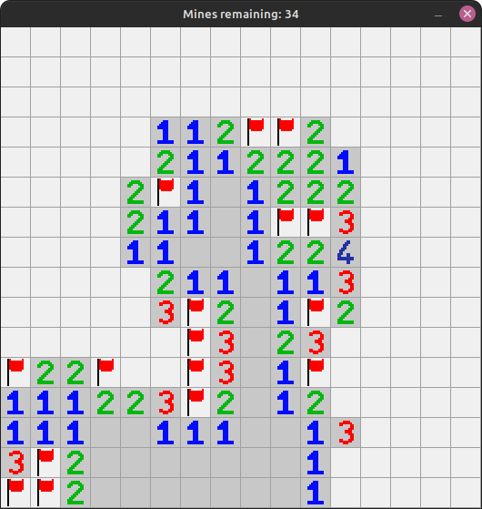

# Minesweeper
 

## Controls

| Input | Effect |
|-|-|
| Left Click | Reveal Cell |
| Right Click | Flag Cell |
| T | Toggle Sweeping Square |
| F | Toggle Full Assist Mode |
| Space | Auto-Reveal |
| M | Restart with same seed |
| R | Restart |